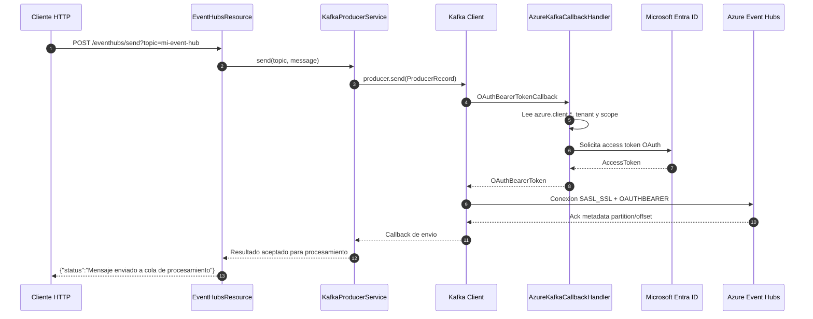

# PoC Event Hubs con Quarkus y Service Principal

PoC de una aplicación Quarkus que publica mensajes en Azure Event Hubs usando el endpoint compatible con Apache Kafka. La autenticación no usa connection strings ni credenciales SAS compartidas de Event Hubs; usa OAuth 2.0 con un Service Principal de Microsoft Entra ID y un `AuthenticateCallbackHandler` propio para entregar el token al Kafka Client.

> Nota: en el código actual la credencial configurada es `azure.client.secret`. Si el PoC se mueve a certificado, la pieza que cambia es la construccion de la credencial dentro de `AzureKafkaCallbackHandler`; el flujo SASL/OAUTHBEARER y el callback se mantienen.

## Como está compuesta la aplicación

- `EventHubsResource`: expone el endpoint REST `POST /eventhubs/send?topic=<event-hub>`. Recibe el cuerpo como texto plano y delega el envio al servicio productor.
- `KafkaProducerService`: crea un `KafkaProducer<String, String>` nativo de Apache Kafka. Lee todas las propiedades con prefijo `kafka.` desde `application.properties`, quita ese prefijo y se las entrega al Kafka Client.
- `AzureKafkaCallbackHandler`: implementa `AuthenticateCallbackHandler`. Es invocado por Kafka cuando el mecanismo `OAUTHBEARER` necesita un token. Obtiene un access token desde Microsoft Entra ID y lo envuelve como `OAuthBearerToken`.
- `application.properties`: concentra la configuración de Event Hubs, SASL/OAuth y datos del Service Principal.
- `infra/`: contiene Terraform para crear el Resource Group, Event Hubs Namespace, Event Hub, Consumer Group, App Registration, Service Principal, secreto y asignacion RBAC.
- `request/test.http`: contiene una llamada de prueba al endpoint REST.

## Configuración importante

La configuración Kafka relevante esta en `src/main/resources/application.properties`:

```properties
kafka.bootstrap.servers=<namespace>.servicebus.windows.net:9093
kafka.security.protocol=SASL_SSL
kafka.sasl.mechanism=OAUTHBEARER
kafka.sasl.jaas.config=org.apache.kafka.common.security.oauthbearer.OAuthBearerLoginModule required;
kafka.sasl.login.callback.handler.class=com.nttdata.AzureKafkaCallbackHandler

azure.client.id=<client-id>
azure.client.secret=<client-secret>
azure.tenant.id=<tenant-id>
```

Puntos clave:

- `kafka.bootstrap.servers` apunta al namespace de Event Hubs por el puerto Kafka `9093`.
- `SASL_SSL` habilita TLS más autenticación SASL.
- `OAUTHBEARER` indica que el Kafka Client necesita un bearer token OAuth.
- `kafka.sasl.login.callback.handler.class` conecta Kafka con `AzureKafkaCallbackHandler`.
- El scope usado para pedir el token es `https://<namespace>.servicebus.windows.net/.default`. Si `azure.scope` no está definido, el callback lo deriva desde `kafka.bootstrap.servers`.

## Flujo de comunicación



## Funcionamiento del callback de autenticación

`AzureKafkaCallbackHandler` participa en dos momentos:

1. `configure(...)`: Kafka lo inicializa al crear el productor. El handler lee `azure.client.id`, `azure.client.secret`, `azure.tenant.id` y calcula el scope de Event Hubs.
2. `handle(...)`: Kafka le entrega un `OAuthBearerTokenCallback`. El handler pide un token a Entra ID usando Azure Identity, crea un `AzureOAuthBearerToken` con el valor y expiración del token, y lo devuelve al Kafka Client.

Con ese token, Event Hubs valida que el Service Principal tenga permisos RBAC sobre el namespace. En Terraform se asigna el rol `Azure Event Hubs Data Owner` a nivel de namespace para permitir producir y consumir.

## Ejecutar en modo desarrollo

```shell
./mvnw quarkus:dev
```

En Windows:

```shell
.\mvnw.cmd quarkus:dev
```

Luego se puede enviar un mensaje con:

```shell
curl -X POST "http://localhost:8080/eventhubs/send?topic=mi-event-hub" \
  -H "Content-Type: text/plain" \
  -d "Hola desde Quarkus con Service Principal"
```

## Terraform

Después de `terraform apply`, se pueden consultar los valores necesarios para `application.properties`:

```bash
# Ver todos los valores, excepto sensibles
terraform output

# Ver el bloque listo para pegar en application.properties
terraform output application_properties_template

# Ver el client_secret, valor sensible
terraform output -raw azure_client_secret
```

## Empaquetado

```shell
./mvnw package
```

El artefacto queda en `target/quarkus-app/` y puede ejecutarse con:

```shell
java -jar target/quarkus-app/quarkus-run.jar
```
